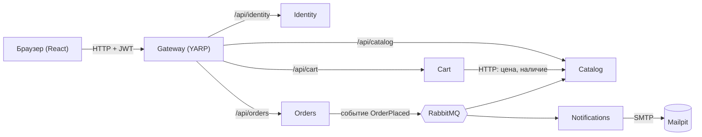

# Shop — интернет-магазин на микросервисах

Учебный проект: онлайн-магазин, разбитый на пять независимых сервисов
и API Gateway, общающихся частично синхронно (HTTP), частично
асинхронно (события через RabbitMQ). Фронтенд — React SPA.

Цель — не «идеальный прод», а осмысленная практика с database-per-service,
JWT-аутентификацией через шлюз, событийной шиной и полной контейнеризацией.

---

## Архитектура

### Сервисы и зона ответственности

| Сервис | Отвечает за | Хранилище |
|---|---|---|
| **Gateway** | единственная точка входа снаружи; проверка JWT; маршрутизация к сервисам; CORS, rate limiting | — (без своей БД) |
| **Identity** | регистрация, вход, роли (`Admin`, `Customer`), выдача JWT и refresh-токенов | PostgreSQL (`identity_db`) |
| **Catalog** | товары, категории, изображения, остатки, поиск/фильтрация/пагинация | PostgreSQL (`catalog_db`) + Redis (кэш) |
| **Cart** | корзина пользователя, гостевые и авторизованные сессии | Redis (основное хранилище, не кэш) |
| **Orders** | оформление заказа, статусы, оплата, webhook от платёжки | PostgreSQL (`orders_db`) |
| **Notifications** | отправка писем по событиям (подтверждение заказа, оплата и т.д.) | PostgreSQL (`notifications_db`, лог писем) |

Каждый сервис — отдельный процесс, отдельный образ Docker, отдельная база
данных. Сервисы не имеют прямого доступа к чужим базам — только к своей.

### Кто с кем общается

**Снаружи внутрь — только через Gateway.**
Браузер (React) никогда не обращается к сервисам напрямую — все запросы
идут на Gateway (`/api/catalog/**`, `/api/identity/**` и т.д.), который
проверяет JWT и проксирует запрос дальше. Сами сервисы находятся во
внутренней docker-сети и снаружи недоступны.

**Синхронное общение (HTTP) — только одно исключение.**
Cart обращается к Catalog напрямую по HTTP, чтобы получить актуальную
цену и название товара при формировании корзины. Это осознанная точка
связанности: Cart не хранит копию цены у себя, чтобы не показывать
пользователю устаревшую стоимость.

**Асинхронное общение (события через RabbitMQ + MassTransit) — основной канал между сервисами.**
Orders публикует события о жизненном цикле заказа, остальные сервисы
на них подписываются, не зная друг о друге напрямую:



| Событие | Публикует | Слушают |
|---|---|---|
| `OrderPlaced` | Orders | Catalog (резерв остатков), Notifications (письмо) |
| `OrderPaid` | Orders | Notifications (письмо об оплате) |
| `OrderCancelled` | Orders | Catalog (снятие резерва), Notifications |
| `StockReserved` | Catalog | Orders (подтверждение резерва) |

Издатель не знает, кто подписан и сколько подписчиков. Гарантия доставки
брокера — «хотя бы один раз» (at-least-once), поэтому каждый consumer
обязан быть идемпотентным: обработка одного и того же события дважды
не должна давать двойной эффект (двойное письмо, двойное списание и т.д.).

### Почему у каждого сервиса своя база

Внутри одного инстанса PostgreSQL живут четыре независимые логические
базы (`identity_db`, `catalog_db`, `orders_db`, `notifications_db`).
Между ними физически невозможен JOIN — это не ограничение, а осознанный
барьер: он не даёт случайно «срезать угол» и прочитать чужие данные
напрямую, а не через API или событие.

Из этого вытекает прямое следствие: данные иногда сознательно дублируются.
Например, `Orders` хранит название и цену товара **снимком** внутри
`OrderItem` на момент покупки — так заказ остаётся неизменным, даже если
Catalog завтра поменяет цену.

### Инфраструктура

| Компонент | Роль |
|---|---|
| PostgreSQL | реляционное хранилище для Identity, Catalog, Orders, Notifications |
| Redis | основное хранилище Cart; кэш популярных товаров и категорий в Catalog |
| RabbitMQ + MassTransit | асинхронная шина событий между сервисами |
| Mailpit | локальная SMTP-ловушка для писем при разработке |
| YARP (в Gateway) | единая точка входа, маршрутизация, проверка JWT |

---

## Структура репозитория

```
shop/
├── docker-compose.yml
├── .env                  ← в .gitignore
├── .env.example          ← в репозитории, с фейковыми значениями
├── Directory.Build.props
├── Shop.sln
├── docker/
│   └── postgres/
│       └── init-databases.sql
├── shared/
│   └── Shop.Shared/          ← контракты событий, DTO, константы. Без бизнес-логики
├── gateway/
│   └── Shop.Gateway/
├── services/
│   ├── Identity/Shop.Identity.Api/
│   ├── Catalog/Shop.Catalog.Api/
│   ├── Cart/Shop.Cart.Api/
│   ├── Orders/Shop.Orders.Api/
│   └── Notifications/Shop.Notifications.Api/
└── frontend/              ← появится на этапе 04
```

---

## Как запустить

```bash
cp .env.example .env    # заполнить реальными значениями
docker compose up -d
docker compose ps       # дождаться healthy у всех
```

Панели для отладки:

| Адрес | Что это |
|---|---|
| http://localhost:15672 | RabbitMQ (логин/пароль из `.env`) |
| http://localhost:8025 | Mailpit — тут появляются письма |

Проброшенные порты инфраструктуры:

| Порт | Сервис |
|---|---|
| `5433` | PostgreSQL (нестандартный, чтобы не конфликтовать с локальным) |
| `6379` | Redis |
| `5672` | RabbitMQ (AMQP) |
| `15672` | RabbitMQ (панель управления) |
| `1025` | Mailpit (SMTP) |
| `8025` | Mailpit (веб-интерфейс) |

---

## Стек

.NET 10 · C# 14 · ASP.NET Core (контроллеры) · EF Core 10 + PostgreSQL ·
Redis · RabbitMQ + MassTransit · AutoMapper · Serilog · FluentValidation ·
ImageSharp · Gateway на YARP · JWT-аутентификация ·
React + TypeScript + Vite + Tailwind + TanStack Query ·
Docker Compose · GitHub Actions

---

## Статус

- [x] Этап 00 — фундамент и инфраструктура
- [ ] Этап 01 — Identity
- [ ] Этап 02 — Catalog
- [ ] Этап 03 — Gateway
- [ ] Этап 04 — React
- [ ] Этап 05 — Cart
- [ ] Этап 06 — RabbitMQ
- [ ] Этап 07 — Orders
- [ ] Этап 08 — Notifications
- [ ] Этап 09 — Админка
- [ ] Этап 10 — Надёжность и наблюдаемость
- [ ] Этап 11 — Тесты и CI
- [ ] Этап 12 — Деплой
